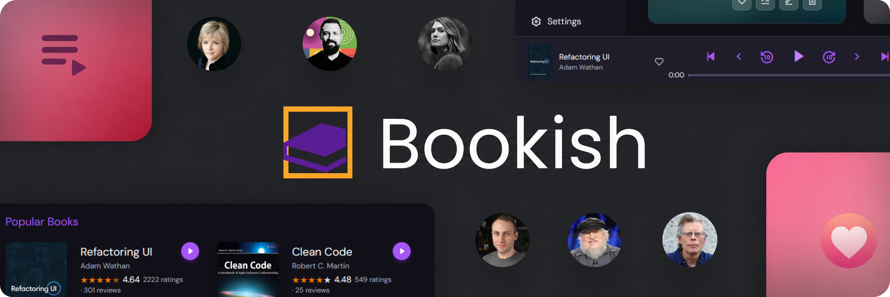

<div align="center">
  <br /><br />

  # Bookish

  **Your personal digital library and audiobook player.**<br />
  Read EPUBs and PDFs, listen with neural text-to-speech, and let Bookish automatically enrich your collection with covers, ratings, and metadata.

  <br />

  
  
  
  
  

  <br />

  <!-- Replace with an actual screenshot once available -->
  

</div>

<br />

---

## Features

**Library** &nbsp;·&nbsp; Browse and manage your entire collection at once. Filter by author, genre, series, or custom collection. Track reading status — Unread, Reading, or Finished — and assign personal star ratings to every book.

**EPUB & PDF Reader** &nbsp;·&nbsp; A distraction-free, built-in reader with chapter navigation, a slide-out table of contents, pinch-to-zoom controls, and an independent dark/light mode that doesn't affect the rest of the app.

**Text-to-Speech** &nbsp;·&nbsp; Turn any book into an audiobook in one click. Powered by Microsoft Edge Neural voices (US, UK, and Australian accents) with real-time word-level highlighting so you can follow along. Skip sentences, rewind 10 seconds, adjust playback speed, and navigate between books — all from the persistent player bar.

**Smart Metadata Enrichment** &nbsp;·&nbsp; Add a title and author and Bookish does the rest. Cover images, blurbs, publication year, and Goodreads community ratings are automatically pulled from Google Books, Open Library, Goodreads, and the Internet Archive.

**Favourites, Collections & Playlists** &nbsp;·&nbsp; Heart books to surface them on your home screen, build named collections for themed reading lists, and queue up playlists for back-to-back listening sessions.

**Author Profiles** &nbsp;·&nbsp; Every author gets a dedicated page with a photo, biography, and their full catalogue from your library.

**Settings** &nbsp;·&nbsp; Control reader zoom defaults, app theme (light/dark), TTS voice selection, and more — all in one place alongside a live snapshot of your library stats.

<br />

---

## Screenshots

> Screenshots coming soon — placeholders will be replaced once available.

<!-- Recommended shots: Home dashboard, EPUB reader, Playing bar, Author page, Settings -->

| Home | Reader | Now Playing |
|:---:|:---:|:---:|
|  |  |  |

| Authors | Collections | Settings |
|:---:|:---:|:---:|
|  |  |  |

<br />

---

## Tech Stack

| Layer | Technology |
|:---|:---|
| Framework | [Nuxt 4](https://nuxt.com) + [Vue 3](https://vuejs.org) |
| Database | [Neon](https://neon.tech) (serverless PostgreSQL) |
| ORM | [Drizzle ORM](https://orm.drizzle.team) |
| Text-to-Speech | [msedge-tts](https://github.com/Migushthe2nd/msedge-tts) + [Kokoro JS](https://github.com/juntran/kokoro-js) |
| PDF Rendering | [PDF.js](https://mozilla.github.io/pdf.js) |
| EPUB Parsing | [JSZip](https://stuk.github.io/jszip) |
| Metadata Sources | Goodreads · Google Books · Open Library · Internet Archive |
| Icons | [Remix Icon](https://remixicon.com) |

<br />

---

## Getting Started

### Prerequisites

- [Node.js](https://nodejs.org) **v18 or later**
- A [Neon](https://neon.tech) account — the free tier is sufficient

### 1. Clone the repository

```bash
git clone https://github.com/your-username/bookish.git
cd bookish
```

### 2. Install dependencies

```bash
npm install
```

### 3. Configure environment variables

Create a `.env` file in the project root:

```env
DATABASE_URL=postgresql://<user>:<password>@<host>/<database>?sslmode=require
```

Get your connection string from the [Neon Console](https://console.neon.tech) under **Connection Details → Connection string**.

### 4. Push the database schema

```bash
npx drizzle-kit push
```

This introspects [`server/database/schema.ts`](./server/database/schema.ts) and creates all required tables in your Neon database.

### 5. Start the development server

```bash
npm run dev
```

Open [http://localhost:3000](http://localhost:3000) — your library is ready.

<br />

---

## Building for Production

```bash
# Build
npm run build

# Preview the production build locally
npm run preview
```

When deploying (e.g. to Vercel or Railway), add `DATABASE_URL` as an environment variable in your hosting provider's project settings.

<br />

---

## Project Structure

```
bookish/
├── components/        # Vue components (reader, sidebar, player bar, modals…)
├── composables/       # Shared logic (useBooks, useTTS, useEpubExtractor…)
├── pages/             # File-based routing (/, /books, /reader/[id], /settings…)
├── server/
│   ├── api/           # Nuxt server routes (books, authors, collections, TTS…)
│   ├── database/      # Drizzle schema + migrations
│   └── utils/         # Scrapers and API clients (Goodreads, Google Books…)
├── workers/           # Web Workers for background processing
├── public/            # Static assets and cached cover images
└── assets/css/        # Global styles and CSS variables
```

<br />

---
