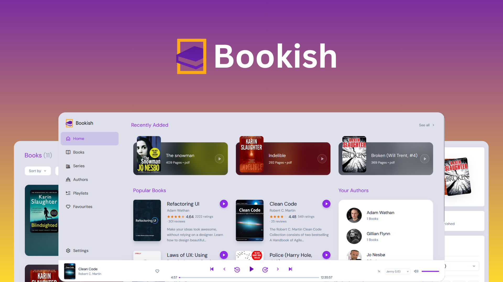
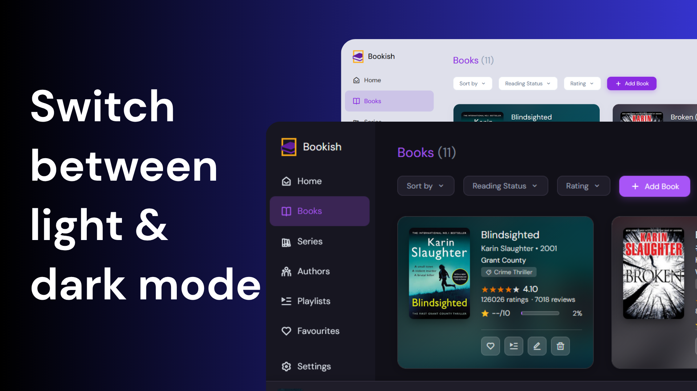
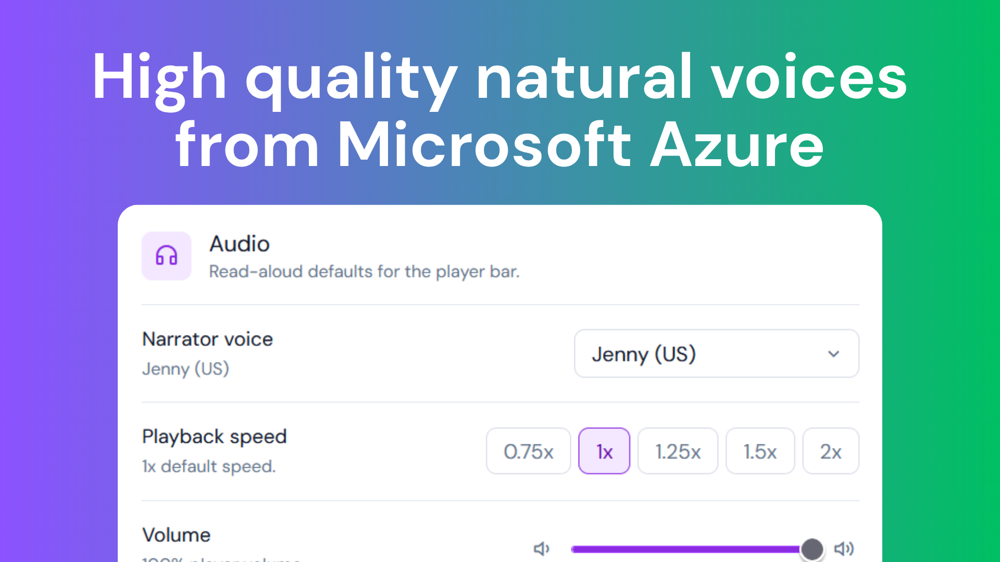

<div align="center">
  <br /><br />

  # Bookish

  **A local-first reading and listening library.**<br />
  Import EPUB, PDF, and text files, keep your library private on your device, listen with read-aloud controls, and enrich books with web metadata when you want it.

  <br />
  <p align="center">
    
    &nbsp;
    
    &nbsp;
    
  </p>
  <br />

  
</div>

<br />

---

## Features

**Local-first library** - Books, playlists, profiles, settings, reading progress, and extracted reading content are stored in the browser with IndexedDB and localStorage. No account or shared database is required.

**EPUB, PDF, and text import** - Upload documents manually in the web app, or use the Android build to scan selected device folders for EPUB and PDF files. Native PDF files are kept on device storage when available so large documents do not have to live entirely in IndexedDB.

**Reader and progress tracking** - Read EPUBs and PDFs in-app, resume recent books, track unread/reading/read states, favourite books, and keep series grouped with installment and total counts.

**Read aloud** - Use Microsoft Edge neural voices and Kokoro-powered TTS paths with persistent player controls, sentence navigation, playback speed, and word-level highlighting where supported.

**Metadata enrichment** - Search Goodreads, Google Books, Kobo, Open Library, the Internet Archive, publisher pages, and cover image sources to fill in covers, blurbs, publication data, ratings, series fields, and author details. Optional Gemini or Groq verification can clean up risky metadata.

**Authors, series, playlists, and favourites** - Browse derived author and genre views, inspect author profiles, group books into playlists, and surface favourites and current reads from the home screen.

**Storage tools** - Export, import, or wipe a full Bookish backup from Settings. The backup includes library records, playlists, profiles, reading content, TTS session state, and settings.

<br />

---

## Gallery





<br />

---

## Tech Stack

| Layer | Technology |
|:---|:---|
| App framework | [Nuxt 4](https://nuxt.com) + [Vue 3](https://vuejs.org) |
| Mobile shell | [Capacitor 8](https://capacitorjs.com) |
| Local data | IndexedDB, localStorage, Capacitor Filesystem |
| PWA | [@vite-pwa/nuxt](https://vite-pwa-org.netlify.app/frameworks/nuxt.html) |
| Text-to-speech | [msedge-tts](https://github.com/Migushthe2nd/msedge-tts), [Kokoro JS](https://github.com/juntran/kokoro-js), Capacitor text-to-speech |
| PDF rendering | [PDF.js](https://mozilla.github.io/pdf.js) |
| EPUB parsing | [JSZip](https://stuk.github.io/jszip) |
| Metadata sources | Goodreads, Google Books, Kobo, Open Library, Internet Archive, publisher sites |
| Icons | [Remix Icon](https://remixicon.com) |
| Tests | [Vitest](https://vitest.dev), Nuxt Test Utils, happy-dom, fake-indexeddb |

<br />

---

## Getting Started

### Prerequisites

- [Node.js](https://nodejs.org) 22 or later
- npm
- Android Studio if you want to run the native Android build

### 1. Clone the repository

```bash
git clone https://github.com/JeremyShiroya/bookish.git
cd bookish
```

### 2. Install dependencies

```bash
npm install
```

### 3. Configure optional environment variables

Bookish can run without a `.env` file. The web app uses its own Nuxt server routes for metadata and TTS during development.

For a hosted web app or native app, set an API base URL when metadata/TTS routes live somewhere other than the current origin:

```env
NUXT_PUBLIC_API_BASE_URL=https://your-bookish-server.example
```

The native app can also store or change this URL from Settings -> Storage.

Optional AI metadata verification:

```env
BOOKISH_AI_PROVIDER=gemini
GEMINI_API_KEY=<your-google-ai-studio-key>
GEMINI_MODEL=gemini-2.5-flash

# Or use Groq instead
# BOOKISH_AI_PROVIDER=groq
# GROQ_API_KEY=<your-groq-key>
# GROQ_MODEL=llama-3.3-70b-versatile
```

Optional build number override:

```env
BOOKISH_BUILD_NUMBER=123
```

### 4. Start the development server

```bash
npm run dev
```

Open [http://localhost:3000](http://localhost:3000).

<br />

---

## Scripts

```bash
npm run dev        # Start Nuxt locally
npm run build      # Build the Nuxt app
npm run generate   # Generate the static app output
npm run preview    # Preview the production build
npm run cap:sync   # Generate web output and sync Capacitor
npm run cap:open:android
```

There is no database setup step. Bookish no longer uses Neon, Drizzle, or `DATABASE_URL`.

Tests are run directly with Vitest:

```bash
npx vitest run
```

<br />

---

## Android Build

The Android project lives in `android/` and uses Capacitor. It includes native helpers for:

- scanning selected folders for EPUB and PDF files
- importing device files into the local library
- storing PDF sources and cached covers on the device filesystem
- background/media-session support for read-aloud playback

After changing web code, sync the native project:

```bash
npm run cap:sync
npm run cap:open:android
```

The native shell needs a reachable Bookish server URL for web metadata and TTS routes unless those features are not being used.

<br />

---

## Data Model

Bookish stores user data locally:

| Store | Purpose |
|:---|:---|
| `bookish-library` IndexedDB | books, playlists, local profile records |
| `bookish-storage` IndexedDB | extracted reading content and PDF source markers |
| localStorage | settings, TTS session state, API base URL, Android scan preferences |
| Capacitor Filesystem | native PDF files and cached image assets when available |

The Settings storage panel can export and import a complete JSON backup of the local data.

<br />

---

## Project Structure

```text
bookish/
|-- android/           # Capacitor Android project and native plugins
|-- assets/css/        # Global styles and theme variables
|-- components/        # Desktop, mobile, and shared Vue components
|-- composables/       # Local storage, reader, metadata, TTS, settings, and backup logic
|-- docs/              # Design notes, screenshots, and gallery assets
|-- pages/             # Nuxt file-based routes
|-- plugins/           # Client plugins for native sync, media session, analytics, and app hooks
|-- public/            # Static images, icons, and app assets
|-- server/api/        # Metadata, cover, author, and TTS server routes
|-- server/utils/      # Scrapers, API clients, aggregators, and AI verifiers
`-- tests/             # Vitest coverage for app behavior and regressions
```

<br />

---
