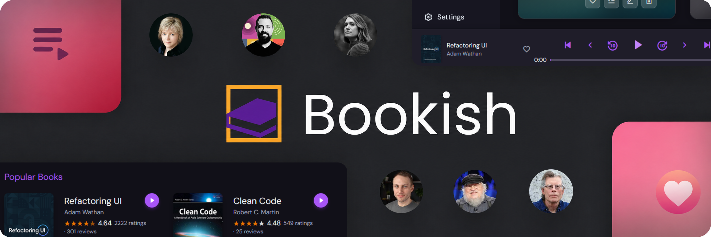
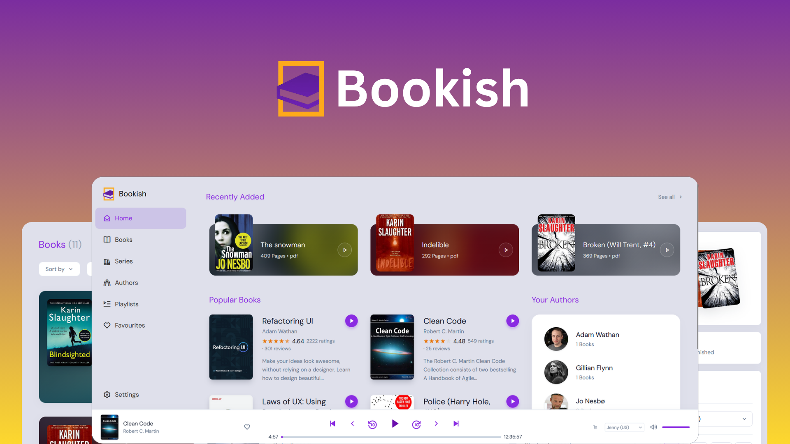
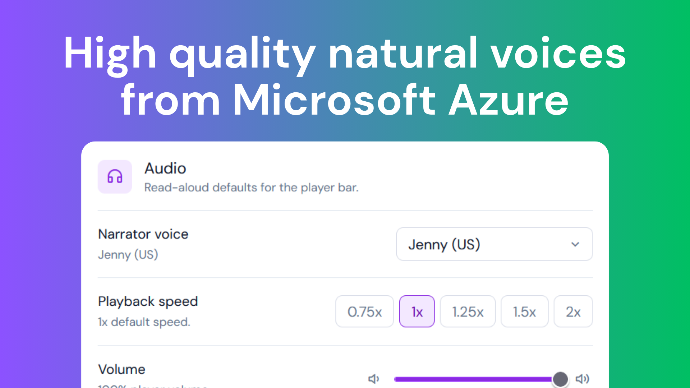

<div align="center">
  <br /><br />

  # Bookish

  **A local-first reading and listening library.**<br />
  Import EPUB, PDF, and text files, keep your library private on your device, listen with read-aloud controls, and enrich books with web metadata when you want it.

  <br />
  <p align="center">
    
    &nbsp;
    
    &nbsp;
    
  </p>
  <br />

  
</div>

<br />

---

## Features

**Local-first library** - Books, playlists, profiles, settings, reading progress, and extracted reading content are stored in the browser with IndexedDB and localStorage. No account or shared database is required.

**EPUB, PDF, and text import** - Upload documents manually in the web app, or use the Android build to scan selected device folders for EPUB and PDF files. Native PDF files are kept on device storage when available so large documents do not have to live entirely in IndexedDB.

**Reader and progress tracking** - Read EPUBs and PDFs in-app, resume recent books, track unread/reading/read states, favourite books, and keep series grouped with installment and total counts.

**Read aloud** - Use Microsoft Edge neural voices and Kokoro-powered TTS paths with persistent player controls, sentence navigation, playback speed, and word-level highlighting where supported.

**Metadata enrichment** - Search Goodreads, Google Books, Kobo, Open Library, the Internet Archive, publisher pages, and cover image sources to fill in covers, blurbs, publication data, ratings, series fields, and author details. Optional Gemini or Groq verification can clean up risky metadata.

**Authors, series, playlists, and favourites** - Browse derived author and genre views, inspect author profiles, group books into playlists, and surface favourites and current reads from the home screen.

**Storage tools** - Export, import, or wipe a full Bookish backup from Settings. The backup includes library records, playlists, profiles, reading content, TTS session state, and settings.

<br />

---

## Gallery





<br />

---

## Tech Stack

| Layer | Technology |
|:---|:---|
| App framework | [Nuxt 4](https://nuxt.com) + [Vue 3](https://vuejs.org) |
| Mobile shell | [Capacitor 8](https://capacitorjs.com) |
| Local data | IndexedDB, localStorage, Capacitor Filesystem |
| PWA | [@vite-pwa/nuxt](https://vite-pwa-org.netlify.app/frameworks/nuxt.html) |
| Text-to-speech | [msedge-tts](https://github.com/Migushthe2nd/msedge-tts), [Kokoro JS](https://github.com/juntran/kokoro-js), Capacitor text-to-speech |
| PDF rendering | [PDF.js](https://mozilla.github.io/pdf.js) |
| EPUB parsing | [JSZip](https://stuk.github.io/jszip) |
| Metadata sources | Goodreads, Google Books, Kobo, Open Library, Internet Archive, publisher sites |
| Icons | [Remix Icon](https://remixicon.com) |
| Tests | [Vitest](https://vitest.dev), Nuxt Test Utils, happy-dom, fake-indexeddb |

<br />

---

## Getting Started

### Prerequisites

- [Node.js](https://nodejs.org) 22 or later
- npm
- Android Studio if you want to run the native Android build

### 1. Clone the repository

```bash
git clone https://github.com/JeremyShiroya/bookish.git
cd bookish
```

### 2. Install dependencies

```bash
npm install
```

### 3. Configure optional environment variables

Bookish can run without a `.env` file. The web app uses its own Nuxt server routes for metadata and TTS during development.

For a hosted web app or native app, set an API base URL when metadata/TTS routes live somewhere other than the current origin:

```env
NUXT_PUBLIC_API_BASE_URL=https://your-bookish-server.example
```

The native app can also store or change this URL from Settings -> Storage.

Optional AI metadata verification:

```env
BOOKISH_AI_PROVIDER=gemini
GEMINI_API_KEY=<your-google-ai-studio-key>
# Evergreen alias — pinned versions (e.g. gemini-2.5-flash) eventually retire
# and return 404 "no longer available to new users" on newly issued keys.
GEMINI_MODEL=gemini-flash-latest

# Or use Groq instead
# BOOKISH_AI_PROVIDER=groq
# GROQ_API_KEY=<your-groq-key>
# GROQ_MODEL=llama-3.3-70b-versatile
```

### Serving series suggestions to many readers

Resolving a series costs a Goodreads scrape (rate-limited per network, and it
starts returning 202 anti-bot stubs when hit too often) or an AI call drawn from
one shared quota. Both get *worse* with more readers, while the answer — this
series' book list — is identical for everyone. Two layers fix that.

**Bundled seed.** `public/series-seed.json` ships rosters that have already been
resolved and verified, hydrated at app start. A reader who owns a seeded series
sees every missing book immediately: no network, no quota, works offline. It is
a seed, not an authority — anything the device resolved itself wins, and the
sweep can still top it up.

Only ever build it from real resolved caches, never a hand-written or generated
list: the entire pipeline exists to guarantee nothing is stored until a provider
confirmed it, and seeding unverified titles would smuggle around that.

```bash
node scripts/build-series-seed.mjs dump.json   # see the script header for the dump
```

**Server cache.** When `NUXT_PUBLIC_API_BASE_URL` points at a deployment, both
`/api/books/series-books` (Goodreads roster) and `/api/books/series-order` (AI
ordering) are cached server-side, keyed on the SERIES rather than on the asking
reader — so the hundredth person to ask about a series costs nothing, and the
key never leaves the server. Caching the roster also means fewer Goodreads hits
overall, which is what triggers the walls in the first place.

It uses Nitro's storage layer, so a single instance works out of the box on
memory. For a real deployment, mount `cache` at Redis/KV in `nitro.storage` and
the cache becomes shared across instances with no code change.

### Release signing (and not losing the library)

Android refuses to install an APK whose signing certificate differs from the one
already installed, and uninstalling takes the app's data with it — the books,
covers and PDFs. The JSON backup in Settings → Storage exports IndexedDB, but
covers and PDFs live on the filesystem, so it is **not** a complete safety net on
its own.

So moving a phone from a debug-signed build to a properly signed one is done by
**key rotation**, not by uninstalling. APK Signature Scheme v3 lets the old key
sign a "lineage" authorising the new key; a release APK carrying that lineage
installs straight over the debug-signed app, keeping everything.

```bash
# 1. Create the release keystore (once), from the repo root. Pick your own
#    password. keytool ships inside a JDK and is usually NOT on PATH — on
#    Windows use the one bundled with Android Studio:
#      "C:\Program Files\Android\Android Studio\jbr\bin\keytool.exe"
keytool -genkeypair -v -keystore android/bookish-release.jks \
  -alias bookish -keyalg RSA -keysize 4096 -validity 10000

# 2. Record it for Gradle (android/keystore.properties — git-ignored)
#    storeFile=bookish-release.jks
#    storePassword=...
#    keyAlias=bookish
#    keyPassword=...

# 3. Bless the new key with the old one (once)
./scripts/sign-release-apk.sh rotate

# 4. Build, then sign with the lineage (every release)
npm run cap:sync && (cd android && ./gradlew assembleRelease)
./scripts/sign-release-apk.sh sign android/app/build/outputs/apk/release/app-release.apk

# 5. Installs over the existing app, library intact
adb install -r android/app/build/outputs/apk/release/app-release-signed.apk
```

**Back up `bookish-release.jks` AND `signing-lineage.bin` somewhere private.**
Lose the keystore and no future build can ever update an installed app; lose the
lineage and release builds stop being able to replace anything signed with the
old key. Both are git-ignored and must never be committed.

Without a keystore configured the release build is simply left unsigned rather
than failing, so a fresh clone and CI still work.

While the installed build is still debuggable, a complete raw backup can be
taken over USB — this captures the filesystem assets and the databases that the
in-app JSON export does not:

```bash
adb exec-out "run-as com.bookish.app tar -cf - ." > bookish-appdata.tar
```

### Development builds install alongside, not over

Once the signing key has been rotated, the installed app trusts the release key
and a debug-signed build can no longer replace it — rotation is one-way, and the
protection that let the release build land without an uninstall works in reverse.

So debug builds carry `applicationIdSuffix ".debug"`: they install as a second
app (`com.bookish.app.debug`, shown as **Pages Dev**) with their own data
directory. The real library is never at risk from a development build, and
because the dev build is still debuggable, WebView inspection over
`chrome://inspect` keeps working there.

```bash
cd android && ./gradlew assembleDebug     # -> Pages Dev, alongside the real app
adb install -r -t app/build/outputs/apk/debug/app-debug.apk
```

The two never collide: the FileProvider authority is `${applicationId}.fileprovider`
and `ApkInstallerPlugin` reads `getPackageName()`, so both follow the suffix.
`package_name` and `custom_url_scheme` are literals in `main/res`, so they are
overridden for the variant in `android/app/src/debug/res/values/strings.xml` —
without that, the dev build would claim the real app's custom url scheme.

### Sideloaded update checks

Pages APKs install outside the Play Store, so nothing tells a user a newer build
exists. On native startup the app fetches a small `version.json` and offers the
download when its `versionCode` beats the installed one.

```env
BOOKISH_UPDATE_MANIFEST_URL=https://github.com/<owner>/<repo>/releases/latest/download/version.json
```

This is **baked into the APK at build time**, and an empty value disables the
update check completely — a build made without it will never prompt, however
many releases are published afterwards. The `releases/latest/download/...` alias
always resolves to the newest release, so the URL never has to change.

To cut a release:

1. Bump `version` in `package.json` and commit (`versionCode` is the git commit
   count, so it must move forward — Android refuses a lower one).
2. Tag `v<version>` and publish a GitHub Release.
3. Attach the signed APK named exactly `bookish-<version>.apk`.

`.github/workflows/publish-version-manifest.yml` then generates `version.json`
and attaches it to that release. It fails loudly if the tag disagrees with
`package.json`, or if the APK asset is missing — a manifest pointing at a
missing download would make the app prompt and then open a 404.

Optional build number override:

```env
BOOKISH_BUILD_NUMBER=123
```

### 4. Start the development server

```bash
npm run dev
```

Open [http://localhost:3000](http://localhost:3000).

<br />

---

## Scripts

```bash
npm run dev        # Start Nuxt locally
npm run build      # Build the Nuxt app
npm run generate   # Generate the static app output
npm run preview    # Preview the production build
npm run cap:sync   # Generate web output and sync Capacitor
npm run cap:open:android
```

There is no database setup step. Bookish no longer uses Neon, Drizzle, or `DATABASE_URL`.

Tests are run directly with Vitest:

```bash
npx vitest run
```

<br />

---

## Android Build

The Android project lives in `android/` and uses Capacitor. It includes native helpers for:

- scanning selected folders for EPUB and PDF files
- importing device files into the local library
- storing PDF sources and cached covers on the device filesystem
- background/media-session support for read-aloud playback

After changing web code, sync the native project:

```bash
npm run cap:sync
npm run cap:open:android
```

The native shell needs a reachable Bookish server URL for web metadata and TTS routes unless those features are not being used.

<br />

---

## Data Model

Bookish stores user data locally:

| Store | Purpose |
|:---|:---|
| `bookish-library` IndexedDB | books, playlists, local profile records |
| `bookish-storage` IndexedDB | extracted reading content and PDF source markers |
| localStorage | settings, TTS session state, API base URL, Android scan preferences |
| Capacitor Filesystem | native PDF files and cached image assets when available |

The Settings storage panel can export and import a complete JSON backup of the local data.

<br />

---

## Project Structure

```text
bookish/
|-- android/           # Capacitor Android project and native plugins
|-- assets/css/        # Global styles and theme variables
|-- components/        # Desktop, mobile, and shared Vue components
|-- composables/       # Local storage, reader, metadata, TTS, settings, and backup logic
|-- docs/              # Design notes, screenshots, and gallery assets
|-- pages/             # Nuxt file-based routes
|-- plugins/           # Client plugins for native sync, media session, analytics, and app hooks
|-- public/            # Static images, icons, and app assets
|-- server/api/        # Metadata, cover, author, and TTS server routes
|-- server/utils/      # Scrapers, API clients, aggregators, and AI verifiers
`-- tests/             # Vitest coverage for app behavior and regressions
```

<br />

---
